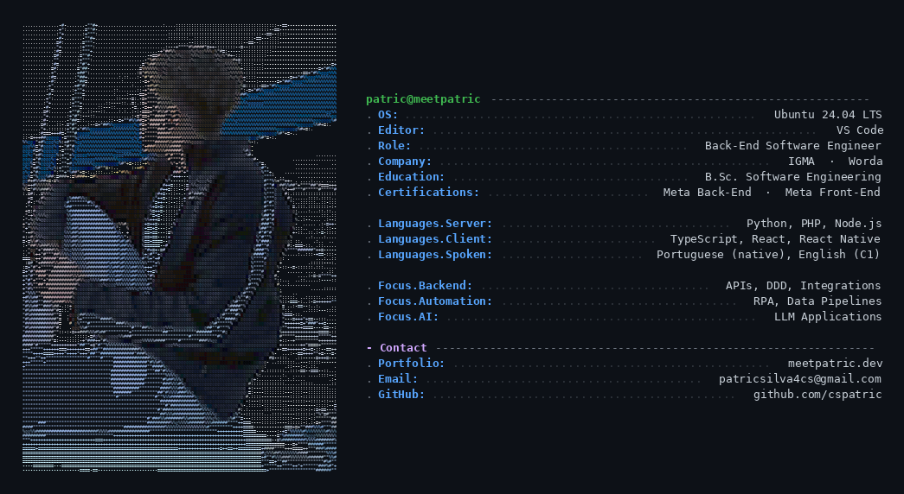

  

  <strong>Back-end focused software engineer</strong> — comfortable across the stack. 
  I build APIs, automations and applied-AI systems that hold up in production.

  
  

---

### About

Software Engineering undergrad at Unileste, with a technical degree in Systems Development from Senac and
both **Meta Back-End** and **Meta Front-End** certifications. I work mainly in Python, PHP and Node on the
server side, and in React / React Native when the interface is mine to build too.

What I actually enjoy: modelling a domain properly, wiring integrations that do not break at 3am, and
putting AI to work on real problems instead of demos.

**Right now** I am a Back-End Software Engineer at **IGMA** and a Front-End Software Engineer at **Worda**.

---

### Stack

**Server** &nbsp;

**Client** &nbsp;

**Data & infra** &nbsp;

---

### Selected work

Each of these has a full write-up — architecture diagrams, code walkthroughs and a video — at
**[meetpatric.dev/projects](https://meetpatric.dev/projects)**.

| Project | What it is | Built with |
| --- | --- | --- |
| **Schedy** | Multi-tenant scheduling platform for salons, barbershops and studios. Each company gets its own domain and fully isolated data. | Laravel 12 · Inertia · React · TypeScript |
| **Transit Pass Management** | RPA and machine learning applied to public transport card issuing — the manual back-office turned into a pipeline. | Laravel · Python · React 19 |
| **Sample Management** | Sample tracking with ERP integration, full audit trail and CI/CD. | FastAPI · SQLAlchemy 2.0 · Alembic · React 19 |
| **ProfPlan** | Study-plan generator driven by an LLM, split into a Python API and a React client. | FastAPI · Gemini · React · Vite |
| **Hvar** | Real-time monitor of Russian attacks, scraping and normalising public sources as they update. | Python · FastAPI · Playwright |

---

### Education & certifications

- **B.Sc. Software Engineering** — Unileste, Catholic University Center *(2024 – present)*
- **Technical Degree, Systems Development** — Senac *(2022 – 2024)*
- **Meta Back-End Developer** *(2025)* · **Meta Front-End Developer** *(2025)*

---

  
    <a href="https://meetpatric.dev">meetpatric.dev</a> ·
    <a href="https://meetpatric.dev/projects">projects</a> ·
    <a href="https://meetpatric.dev/about">résumé</a> ·
    <a href="mailto:patricsilva4cs@gmail.com">patricsilva4cs@gmail.com</a>
  

